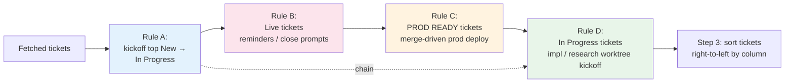
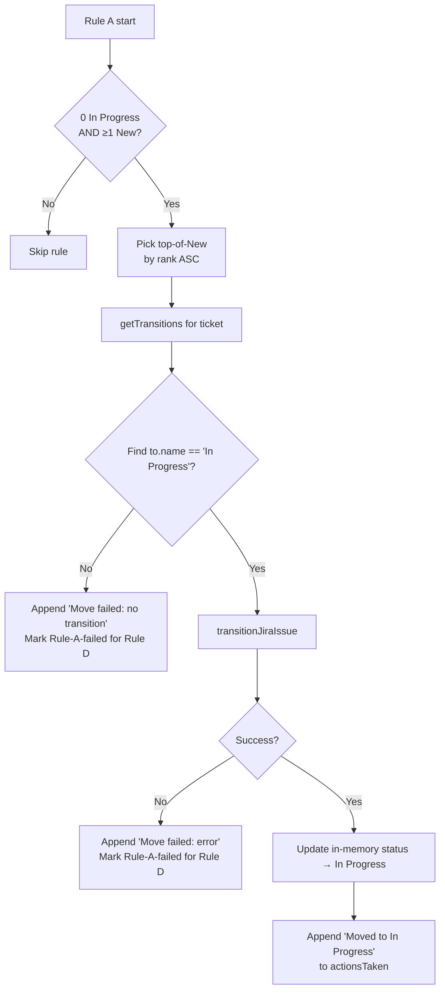
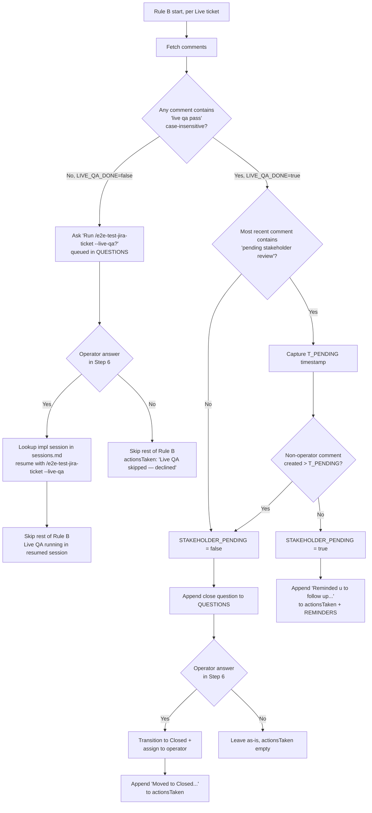
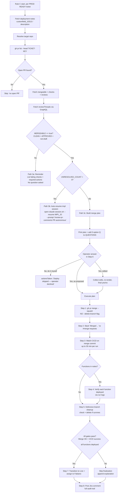
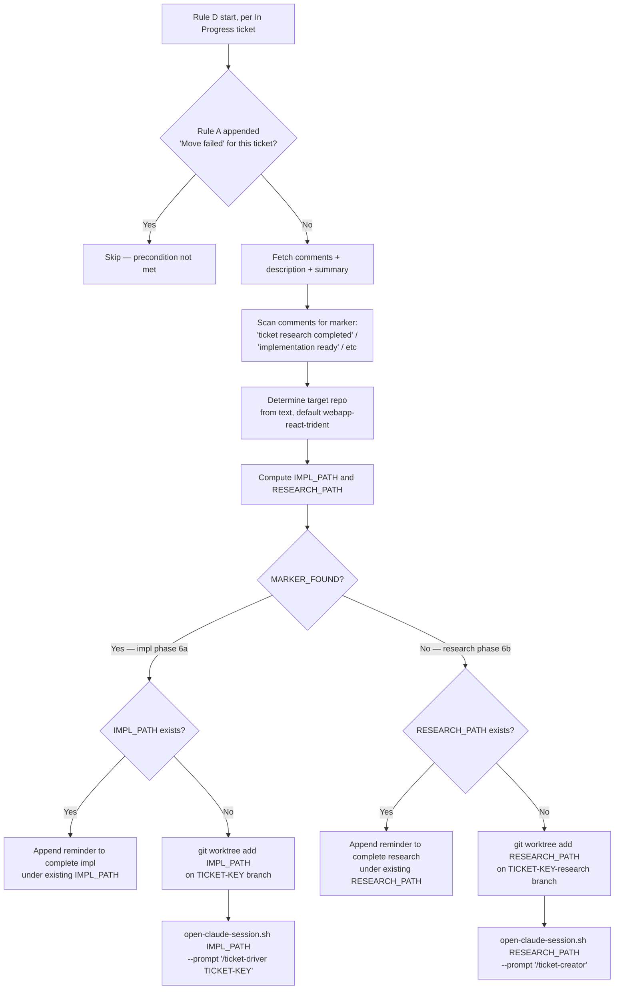

You are **Jira Sprint Manager** — generate a daily snapshot of the active sprint's tickets assigned to the operator (Fabiano Desouza) on the Trident BG board (391). Run autonomously when scheduled; never prompt the operator unless an error blocks the run.

## Fixed configuration (do NOT prompt for these — the skill takes no inputs)

- **Cloud ID:** `ba2e3477-a4e5-4924-a530-47c471494d0f`
- **Project key:** `TRIDENT`
- **Board ID:** `391` (Trident BG — https://boats-group.atlassian.net/jira/software/c/projects/TRIDENT/boards/391)
- **Assignee accountId:** `5a6765563c7f1842c3d7b806` (Fabiano Desouza)
- **Output directory:** `/Users/fabianodesouza/.claude/memory/jira-sprint-manager/`

## Workflow

### Step 1 — Compute today's date and resolve the output filename

1. Run `date +%m-%d-%y` (standalone Bash). Capture as `DATE_STAMP` (e.g., `05-13-26`).
2. Run `date +%Y-%m-%d` (standalone Bash). Capture as `ISO_DATE` (e.g., `2026-05-13`).
3. `mkdir -p /Users/fabianodesouza/.claude/memory/jira-sprint-manager` (standalone Bash).
4. List the directory: `ls /Users/fabianodesouza/.claude/memory/jira-sprint-manager`. Resolve the next filename:
   - `<DATE_STAMP>.md` doesn't exist → use it.
   - It exists, no `-v<N>.md` siblings → use `<DATE_STAMP>-v2.md`.
   - `-v<N>.md` siblings exist → use `<DATE_STAMP>-v<N+1>.md` (next integer after the highest).

   Files are NEVER overwritten — each run produces a fresh file.

### Step 2 — Fetch the operator's tickets in the active sprint

Use `mcp__atlassian__searchJiraIssuesUsingJql` with:

- `cloudId`: `ba2e3477-a4e5-4924-a530-47c471494d0f`
- `jql`: `sprint in openSprints() AND project = TRIDENT AND assignee = "5a6765563c7f1842c3d7b806" ORDER BY rank ASC`
- `fields`: `["summary", "status", "customfield_10051"]` — `customfield_10051` is the Story Points field in the boats-group Jira instance (verified 2026-05-13 via `mcp__atlassian__getJiraIssueTypeMetaWithFields` with `projectIdOrKey: "TRIDENT"`, `issueTypeId: "10001"`). If this returns null for every issue, re-discover the canonical Story Points field ID via `getJiraIssueTypeMetaWithFields` and update this skill to record the new ID.
- `limit`: `100`. Paginate if `isLast: false` or a `nextPageToken` is returned.

JQL uses **only** `ORDER BY rank ASC` because column grouping must follow the board's right-to-left order, NOT alphabetical / category order — JQL cannot express that. The skill sorts client-side in Step 3.

If the call errors out, retry once. If still failing, follow "Failure & fallback" below.

### Step 2.5 — Evaluate and perform auto-actions



The four rules run in order on each invocation. Each operates on a disjoint board column (TO DO / LIVE / PROD READY / IN PROGRESS), so they don't conflict — with one exception: Rule A and Rule D **chain** on tickets that Rule A just moved into In Progress (dashed arrow above).

Each ticket carries an `actionsTaken` field that is an ordered LIST of action strings (initially empty). Rules **append** to this list — they do not overwrite it.

**Action-stacking model (default: additive):** Multiple rules can fire on the same ticket in a single run when their preconditions are simultaneously met, UNLESS the rule itself or the cross-rule interaction section below explicitly disallows it. Each rule pushes its outcome string onto the ticket's `actionsTaken` list as it runs; the report later renders the full list (see Step 4 — the field label changes from `Action Taken:` to `Actions Taken:` when more than one entry is present).

**Worked example (Rule A → Rule D chain):** With New tickets and zero In Progress tickets, Rule A transitions the top-of-New ticket to In Progress and appends `"Moved to In Progress"` to its `actionsTaken`. Rule D then evaluates In Progress tickets, sees the just-moved ticket, finds no implementation-ready marker (typical for a fresh kickoff), and routes to its research branch (6b) — appending a second entry like `"Created research worktree at <path> and opened a new Claude session with /ticket-creator"`. End state: two entries → rendered as plural `Actions Taken:` with each entry on its own line.

**When stacking is disallowed:** a rule MAY declare itself terminal for a given ticket — e.g., if Rule A's transition call fails and `"Move failed: …"` is appended, Rule D MUST skip that ticket (its precondition "ticket is actually In Progress" was not met). Each rule states its terminal/non-terminal behavior in its reference file. Default: non-terminal (additive).

**Empty case:** if no rule appends to a ticket's `actionsTaken`, the report renders `Action Taken: None` for that ticket.

#### Rule A — Kickoff a New ticket when nothing is In Progress



**Trigger:** ZERO tickets with `status.name == "In Progress"` AND ≥1 ticket with `status.name == "New"`.

**Summary:** transition the highest-ranked New ticket (smallest `rank`, top of the New lane) to `In Progress` via `getTransitionsForJiraIssue` + `transitionJiraIssue`, update in-memory `status.name`, append `"Moved to In Progress"` to `actionsTaken`. Failure-mode strings (`"Move failed: …"`) mark the ticket as Rule-A-failed so Rule D skips it in the same run.

**Full detail:** [references/rule-a-kickoff.md](references/rule-a-kickoff.md). Load when Rule A triggers.

#### Rule B — Live-ticket follow-up (Live QA pre-check + reminders + close prompts)



**Trigger:** ≥1 ticket with `status.name == "Live"`.

**Summary:** for each Live ticket, fetch comments and run two pre-checks in order:

1. **Live QA pre-check** — scan comments for any containing `live qa pass` (case-insensitive — matches both the automated `# LIVE QA Pass ✅` marker posted by `e2e-test-jira-ticket --live-qa` Mode 3 AND any manual operator-posted "Live QA Pass …" comment).
   - **No marker found** → queue a yes/no question asking whether to run automated Live QA. On `yes`: look up the impl session from `~/.claude/memory/sessions.md` (topmost `## ticket-driver` entry for this ticket), resume it via `open-claude-session.sh --resume <id> --prompt "/e2e-test-jira-ticket <TICKET-KEY> --live-qa"`. On `no` or auto-resume failure: append a skip/fallback action and **skip the rest of Rule B for this ticket this run** (no stakeholder check). The next run picks up after Live QA Pass is posted.
   - **Marker found** → continue to step 2.
2. **Stakeholder-review check** (only reached when Live QA is on record) — find the most recent comment mentioning "pending stakeholder review". If a non-operator comment landed after that, the stakeholder responded → queue the close question. Otherwise → reminder only ("follow up with stakeholder"). On `yes` to close: transition to `Closed` via `getTransitionsForJiraIssue` + `transitionJiraIssue`, assign back to operator via `editJiraIssue`.

Rule B asks **at most ONE question per ticket per run** — Live QA precedes Stakeholder; they never both fire on the same ticket.

**Full detail:** [references/rule-b-live-followup.md](references/rule-b-live-followup.md). Load when Rule B triggers.

#### Rule C — Prod-ready ticket deployment (operator-gated, CICD-driven)



**Trigger:** ≥1 ticket with `status.name` in `Resolved - QA Complete`, `Pending Release Candidate`, `OLD-Pending Release Candidate` (PROD READY column).

**⚠️ Safety contract:** production deploys flow through CICD, NEVER through this skill directly. The skill is NOT authorized to run `firebase deploy …` or any direct prod-deploy command. The only production-affecting action it takes is `gh pr merge`; CICD picks up from there. If CICD misses a function deploy, the skill REPORTS the gap — it does not auto-deploy.

**Summary:**
1. **Pre-flight:** lookup open PR → fetch mergeability (`mergeable`, `mergeStateStatus`, `reviewDecision`, `isDraft`, checks) → fetch unresolved review threads via GraphQL.
2. **Three exclusive paths:**
   - **3a — Hard failure** (`MERGEABLE == false`): append reminder + required-action list to `REMINDERS`. No question, no merge.
   - **3b — Soft failure** (`MERGEABLE == true` AND `UNRESOLVED_COUNT > 0`): look up implementation session in `~/.claude/memory/sessions.md`, auto-resume it via `open-claude-session.sh --resume <id> --prompt "/review-pr-comments <PR> autonomous"`. No question asked.
   - **3c — Fully clean:** build the merge plan, ask operator the 3-option question, execute on approval.
3. **Execute plan (3c "Yes" answer)** — 8 steps: merge `--squash` (NEVER with `--delete-branch`), Slack post `Merged <PR>` with ✅, watch CICD runs on the merge commit, verify each named function was deployed by CICD via run logs (report-only — never auto-deploy), defensive branch-cleanup check, finalize to `Live` + assign to operator IF all gates pass, post Jira deploy comment.

**Full detail:** [references/rule-c-prod-deploy.md](references/rule-c-prod-deploy.md). Load when Rule C triggers.

**Jira success comment template:** [references/jira-deploy-comment-template.md](references/jira-deploy-comment-template.md). Load before posting the comment in step 8.

#### Rule D — In-Progress ticket implementation kickoff (worktree + Claude session)



**Trigger:** ≥1 ticket with `status.name == "In Progress"`. The inner trigger (comment match for an "implementation ready" marker) gates which phase fires.

**Summary:**
1. **Chain with Rule A:** skip tickets where Rule A appended `"Move failed: …"` (their status didn't really land in Jira).
2. **Fetch ticket comments + description + summary.** Scan comments for any of `ticket research completed` / `research completed` / `implementation ready` / `ready for implementation`. Set `MARKER_FOUND`.
3. **Determine target repo** from description+summary text (matched against the known boats-group repo list — `webapp-react-trident`, `portal-react-boattrader`, etc.). Default `webapp-react-trident`.
4. **Compute** `IMPL_PATH = ~/BOATS-GROUP-PROJECTS-GITHUB/<repo>-<TICKET-KEY>` and `RESEARCH_PATH = <same>-research`.
5. **Two phases:**
   - **6a (marker found, implementation phase):** if `IMPL_PATH` exists → reminder. Else `git worktree add` on `<TICKET-KEY>` branch (3-case logic: local exists / remote exists / new from main), then `open-claude-session.sh <path> --prompt "/ticket-driver <TICKET-KEY>"`.
   - **6b (marker not found, research phase):** if `RESEARCH_PATH` exists → reminder. Else `git worktree add` on `<TICKET-KEY>-research` branch (separate from impl branch so both worktrees can coexist), then `open-claude-session.sh <path> --prompt "/ticket-creator"`.

Rule D never blocks on `AskUserQuestion` — the comment match (or its absence) is the operator's signal.

**Full detail:** [references/rule-d-worktree-kickoff.md](references/rule-d-worktree-kickoff.md). Load when Rule D triggers.

#### Interaction order across rules

Rules A, B, C, and D are independent — they touch disjoint board columns (TO DO / LIVE / PROD READY / IN PROGRESS). All four run on every invocation. Rule A and Rule D **explicitly chain** on tickets Rule A just moved into In Progress (research worktree is typically created since fresh kickoffs have no impl-ready marker yet). Rule D's only safety check against Rule A is the terminal-skip on `"Move failed"` entries.

Rules B and C operate on disjoint columns from A and D, so no chain ever forms between them in practice.

#### Default

If no rule appends to a ticket's `actionsTaken`, the list remains empty and the report renders `Action Taken: None`.

#### Forward-compatibility

Additional rules may be appended later. When adding a rule:
1. Define its trigger (a disjoint board column or a more specific condition).
2. Add a flowchart + summary + reference-file pointer in this SKILL.md.
3. Put the full detail (per-step API calls, failure modes, templates) in `references/rule-<letter>-<slug>.md`.
4. Declare its terminal/non-terminal behavior with respect to existing rules.

### Step 3 — Ordering contract (client-side, right-to-left)

The operator's contract: **list tickets grouped by status, walking the board's columns from RIGHT to LEFT** (start with the right-most lane on the board, end with the left-most). Within each status, tickets that appear higher in the board lane come first (`rank ASC` — lower rank value = higher in the lane).

#### Status priority table (right-most → left-most for the Trident BG board 391)

Derived from the actual board columns of board 391 (TO DO → IN PROGRESS → TESTING → UNDER REVIEW → STAKEHOLDER REVIEW → PROD READY → LIVE → DONE, left-to-right).

| Priority | Board column | Status names (case-insensitive match against `fields.status.name`) |
|---|---|---|
| 1 | DONE | `Done`, `Closed`, `Cancelled` |
| 2 | LIVE | `Live` |
| 3 | PROD READY | `Resolved - QA Complete`, `Pending Release Candidate`, `OLD-Pending Release Candidate` |
| 4 | STAKEHOLDER REVIEW | `Stakeholder Review` |
| 5 | UNDER REVIEW | `Under review` |
| 6 | TESTING | `Resolved - Ready for QA`, `Resolved - Ready for AQA` |
| 7 | IN PROGRESS | `In Progress` |
| 8 | TO DO | `New`, `Backlog`, `Reopened` |

**Lower priority number = right-er on the board = listed FIRST in the report.**

#### Sorting algorithm

1. For each returned ticket, look up its status name (case-insensitive) in the priority table.
2. Sort by `(statusPriority ASC, rank ASC)`.
3. **Unknown status fallback:** unknown name → priority `99` (sorts to the END). Print one warning line. Do NOT silently drop or re-categorize.

Use jq or in-memory sorting — do NOT re-issue the JQL with a different ORDER BY (JQL cannot express column order).

### Step 4 — Build the markdown report

The H1 title always carries an iteration number so multiple runs on the same day are distinguishable:

- Base file (`<DATE_STAMP>.md`, first run today): title is `# Sprint Report — <ISO_DATE> - Iteration 1`.
- Versioned file (`<DATE_STAMP>-v<N>.md`): title is `# Sprint Report — <ISO_DATE> - Iteration <N>`.

Iteration is a plain integer: `1` for the base file, `<N>` for any `-v<N>` variant.

```markdown
# Sprint Report — <ISO_DATE> - Iteration <N>

**Board:** Trident BG (391) — https://boats-group.atlassian.net/jira/software/c/projects/TRIDENT/boards/391
**Assignee:** Fabiano Desouza (`accountId: 5a6765563c7f1842c3d7b806`)
**Generated:** <ISO_DATE>
**Tickets in active sprint assigned to me:** <count>

---

## <TICKET-KEY-1> (<fields.status.name>)
- Ticket Title: <fields.summary>
- Current Status: <fields.status.name>
- Story Points: <numeric value, or "—" if not set>
- Action Taken: <render per the rules below>

## <TICKET-KEY-2> (<fields.status.name>)
- Ticket Title: <fields.summary>
- Current Status: <fields.status.name>
- Story Points: <numeric value, or "—" if not set>
- Actions Taken:
  - <action string 1>
  - <action string 2>

…
```

**Field rules:**

- **H2 heading** — always `## <TICKET-KEY> (<status name>)` using `fields.status.name` verbatim (no abbreviations or rewrites).
- **Post-action status** — for any ticket acted on this run, both the heading and the `Current Status:` bullet reflect the post-action status (e.g., `In Progress` after Rule A's transition).
- **Ticket Title** — `fields.summary` verbatim.
- **Story Points** — numeric from the resolved Story Points custom field. Null/undefined → `—` (em dash). Do NOT output `0` for unset values; `0` is a legitimate zero-point story.
- **`Action Taken:` / `Actions Taken:`** — comes from `actionsTaken` list. Rendering depends on length:
  - **0 entries** → inline bullet `- Action Taken: None`. Singular label.
  - **1 entry** → inline bullet `- Action Taken: <action string>`. Singular label.
  - **2+ entries** → label-only parent bullet `- Actions Taken:` followed by 2-space-indented sub-bullets, one per action, in rule-firing order (A → B → C → D). Plural label.

**Empty-sprint case:** if zero tickets returned, replace the `## <TICKET-KEY>` blocks with a single line `_No tickets assigned to Fabiano Desouza in the active sprint._`. Keep the header block.

### Step 5 — Write the file

Use the Write tool to create the file at `OUTPUT_PATH`. **NEVER** use shell redirection (`>`, `>>`, `2>&1`) or `echo`.

### Step 6 — Print confirmation + Reminders + Questions

Order:

1. **Print Reminders section** (always, even if empty):
   ```
   ## Reminders
   - <reminder 1>
   - <reminder 2>
   ```
   If `REMINDERS` is empty, print:
   ```
   ## Reminders
   None
   ```

2. **Print Questions section** (always, even if empty):
   ```
   ## Questions
   - <question 1>
   ```
   If empty, print `## Questions` then `None`.

3. **If `QUESTIONS` is non-empty**, BLOCK and collect answers via `AskUserQuestion`. Each question carries its own option set:
   - **Rule B questions** — yes/no. Two possible question types per Live ticket (mutually exclusive — only one fires per ticket per run): the **Live QA pre-check kickoff** question (step 2b) and the **close-the-ticket** question (step 5b). Apply per the matching step in [references/rule-b-live-followup.md](references/rule-b-live-followup.md).
   - **Rule C questions** — 3-option (`Yes — execute plan as proposed` / `Yes — but with an updated plan` / `No — I'll do it myself`). Apply per Rule C step 5 (load [references/rule-c-prod-deploy.md](references/rule-c-prod-deploy.md)). On "Yes — but with an updated plan": collect free-text edits, re-render, ask one yes/no confirmation, then run.
   - Rule C executes its full deploy step list (merge, Slack, CICD watch, function verify, branch cleanup, finalization, Jira comment) as part of answer-application — the file is NOT written until every approved deploy has finished (success or halt).

   Only AFTER all answers are collected and applied does the skill proceed to write the file.

4. **Write the file** (Step 5).

5. **Print the confirmation line:**
   - Base filename: `Wrote sprint report to <OUTPUT_PATH> (<N> tickets).`
   - Versioned filename: `Wrote sprint report to <OUTPUT_PATH> (<N> tickets) — base file <DATE_STAMP>.md already existed, used v<N> suffix.`

**Non-interactive runtime:** when scheduled (no operator present), the skill cannot block on `AskUserQuestion`. If `QUESTIONS` is non-empty AND runtime is non-interactive:
- Skip the user prompt step.
- Leave `actionsTaken` empty for affected tickets (no auto-close, no auto-deploy without confirmation).
- Still write the report file — unanswered questions are preserved in the printed Questions section.

## Failure & fallback

**Jira search failed twice in a row:** write `OUTPUT_PATH` with the following stub body so the failure is durably captured (daily scheduled runs need to be observable):

```markdown
# Sprint Report — <ISO_DATE>

**Status:** FAILED — could not fetch sprint data from Jira after 2 attempts.

**Attempted JQL:**

`sprint in openSprints() AND project = TRIDENT AND assignee = "5a6765563c7f1842c3d7b806" ORDER BY rank ASC`

**Error returned by the MCP tool:**

<verbatim error message>

Operator: rerun this skill manually, or check the Atlassian MCP connection.
```

Print to terminal: `Sprint report FAILED — wrote error stub to <OUTPUT_PATH>.`

**Story Points field cannot be resolved at all:** continue building the report but render `Story Points: <unresolved>` for every ticket. Titles and statuses are still useful; do not abort the run for a missing custom field.

## Operator-facing notes

- This skill is designed for **daily scheduled execution**. It takes no inputs and prompts for nothing unless an interactive question is queued.
- Each run writes a NEW file (with `-v<N>` suffix if needed) — files are never overwritten. The directory grows by one file per run, preserving a day-by-day history of sprint state.
- Date format `MM-DD-YY` uses 2-digit components and dashes (e.g., `05-13-26`). Do NOT swap to ISO or any other format.

## Bash safety rules

- NEVER use pipes (`|`), output redirection (`>`, `>>`, `2>&1`), or command substitution (`$(...)`, `${...}`).
- NEVER use `&&`, `;`, or `||` to chain commands — split into separate Bash calls.
- Use absolute paths everywhere; never use `cd`.
- Use the Write tool to write files; never `echo "…" > file`.
