# Mobius Platform — Dependency Graph Visualizations

> Machine-readable graph: `../ecosystem/dependency-graph.yaml`
> Authoritative dependency table: `../ecosystem/master-map.md`

---

## Mermaid Diagram

```mermaid
graph TD
    %% Tier: core
    IEKA["iac-eks-argocd (core)"]
    IEKC["iac-eks-crossplane (core)"]

    %% Tier: gitops
    IEAD["iac-eks-addons (gitops)"]
    IEOB["iac-eks-observability (gitops)"]
    IEA["iac-eks-atlantis (gitops)"]

    %% Tier: infrastructure
    TMCI["terraform-module-core-irsa (infrastructure)"]
    TSMN["terraform-stack-monitoring-ng (infrastructure)"]
    TMEK["terraform-module-eks (infrastructure)"]
    TMDZ["terraform-module-delegated-zone (infrastructure)"]
    ITCI["iac-terragrunt-core-infra (infrastructure)"]

    %% Tier: xrd
    XIRSA["crossplane-xrd-irsa-role (xrd)"]
    XKNR["crossplane-xrd-karpenter-node-role (xrd)"]
    XS3["crossplane-xrd-s3-bucket (xrd)"]
    XSQS["crossplane-xrd-sqs-eventbridge (xrd)"]
    XNLB["crossplane-xrd-gateway-nlb-listener (xrd)"]
    XSEC["crossplane-xrd-generated-aws-secret (xrd)"]
    XOIDC["crossplane-xrd-github-oidc (xrd)"]
    XACM["crossplane-xrd-ingress-acm-certificate (xrd)"]
    CXCLG["crossplane-xrd-cloudwatch-log-group (xrd)"]

    %% Tier: utility
    AEG["argocd-env-generator (utility)"]
    HC["helm-charts (utility)"]
    IEP["iac-eks-pcg (utility)"]
    RCC["react-common-components (utility)"]

    %% Tier: meta
    MT["mobius-tools (meta)"]

    %% Dependencies
    IEKA --> IEAD
    IEKA --> IEOB
    IEKA --> IEKC
    IEKC --> IEKA
    IEAD --> IEKA
    IEAD --> IEKC
    IEAD --> XIRSA
    IEAD --> XKNR
    IEAD --> XSQS
    IEAD --> XS3
    IEOB --> IEKA
    IEOB --> IEAD
    IEOB --> XIRSA
    IEA --> IEKA
    IEA --> IEKC
    IEA --> XIRSA
    ITCI --> TMCI
    ITCI --> TMEK
    ITCI --> TMDZ
    ITCI --> IEKA
    XIRSA --> IEKC
    XKNR --> IEKC
    XKNR --> XIRSA
    XS3 --> IEKC
    XSQS --> IEKC
    XNLB --> IEKC
    XSEC --> IEKC
    XOIDC --> IEKC
    XACM --> IEKC
    CXCLG --> IEKC
    AEG --> IEKA
    IEP --> IEKA

    %% Styling
    classDef core fill:#1a4a7a,color:#fff,stroke:#0d2d4e
    classDef gitops fill:#2a6a4a,color:#fff,stroke:#1a4a2a
    classDef infrastructure fill:#4a6741,color:#fff,stroke:#2d4028
    classDef xrd fill:#7a4a1a,color:#fff,stroke:#4e2d0d
    classDef utility fill:#4a1a7a,color:#fff,stroke:#2d0d4e
    classDef meta fill:#1a7a4a,color:#fff,stroke:#0d4e2d

    class IEKA,IEKC core
    class IEAD,IEOB,IEA gitops
    class TMCI,TSMN,TMEK,TMDZ,ITCI infrastructure
    class XIRSA,XKNR,XS3,XSQS,XNLB,XSEC,XOIDC,XACM,CXCLG xrd
    class AEG,HC,IEP,RCC utility
    class MT meta
```

<!-- GENERATED:MERMAID-DEP-VISUAL:START — do not edit manually; run: python3 scripts/generate-map-tables.py -->





<!-- GENERATED:MERMAID-DEP-VISUAL:END -->

---

## ASCII Diagram — Full Platform

```
TIER: core
===============================================================================
                          iac-eks-argocd
                        (control plane hub)
                              ╔═╗
          ╔═══════════════════╝ ╚════════════════════╗
          ║                                          ║
          ▼                                          ▼
    iac-eks-crossplane                         iac-eks-addons
    (composition factory)                      iac-eks-observability
          ╔═╗                                  (GitOps deployment)
          ╚═╝

TIER: gitops (NEW)
===============================================================================
    iac-eks-addons                    iac-eks-observability
    (addon deployment)                (observability stack)
       ▲ depends on: IEKA, IEKC       ▲ depends on: IEKA, IEAD

TIER: infrastructure
===============================================================================
terraform-module-core-irsa    terraform-stack-monitoring-ng    iac-terragrunt-core-infra
(IRSA Terraform module)       (Monitoring Terraform)           (cluster bootstrap)
   (no deps)                     (no deps)                      ▲ depends on: TMCI, IEKA

TIER: xrd (all depend on iac-eks-crossplane)
===============================================================================
crossplane-xrd-irsa-role          ◄── most used XRD, also depends on iac-eks-addons
crossplane-xrd-karpenter-node-role ◄── also depends on irsa-role, iac-eks-addons
crossplane-xrd-s3-bucket
crossplane-xrd-sqs-eventbridge
crossplane-xrd-gateway-nlb-listener
crossplane-xrd-generated-aws-secret
crossplane-xrd-github-oidc         ◄── STUB (incomplete)
crossplane-xrd-ingress-acm-certificate

  All XRD repos depend on: iac-eks-crossplane
  Some also depend on:     iac-eks-addons

  Publication path: KCL code -> OCI package -> iac-eks-crossplane
                    Configuration CR -> ArgoCD -> EKS clusters

TIER: utility
===============================================================================
argocd-env-generator               ◄── depends on: iac-eks-argocd
  (reads ApplicationSets, stamps out env overlays)

helm-charts                        ◄── no dependencies
  (shared Helm chart configurations)

TIER: meta
===============================================================================
mobius-tools                       ◄── no dependencies
  (resolver scripts, ecosystem map, docs)
  (every other repo bootstraps FROM this repo)
```

---

## ASCII Diagram — Ego-Centric Views

### iac-eks-addons's View

```
                         [iac-eks-argocd]
                              ▲ ApplicationSets
                              │ auto-discover configs
            ┌─────────────────┴──────────────────┐
            │                                    │
      [iac-eks-addons]               [iac-eks-crossplane]
      (YOU ARE HERE)                   ▲ XRD claims
      self-service configs              │ registered here
            │                          │
            ▼                          │
  Teams add config.yaml ───────────────►│
  ArgoCD deploys it    ◄── XRDs registered ──► crossplane-xrd-*
```

### iac-eks-crossplane's View

```
[iac-eks-argocd]
    │ ArgoCD deploys all
    │ providers + functions
    │ + Configuration CRs
    ▼
[iac-eks-crossplane]
(YOU ARE HERE)
    │
    ├── providers/          (provider-aws-*, provider-kubernetes)
    ├── functions/          (function-kcl, function-auto-ready, ...)
    └── configurations/     (OCI refs to crossplane-xrd-* packages)
         │
         ▼
    crossplane-xrd-irsa-role          -> OCI package in JFrog
    crossplane-xrd-karpenter-node-role -> OCI package in JFrog
    crossplane-xrd-s3-bucket          -> OCI package in JFrog
    ... (8 XRD repos total)
```

### iac-eks-argocd's View

```
[iac-eks-argocd]
(YOU ARE HERE — the hub)
    │
    ├── applicationsets/          (Git File Generator ApplicationSets)
    │       │ auto-discovers
    │       ├──► iac-eks-addons overlays
    │       ├──► iac-eks-observability overlays
    │       └──► iac-eks-crossplane overlays
    │
    ├── hubs/{hub}/               (hub bootstrap structure)
    │       └── clusters/{spoke}.yaml  (spoke cluster secrets)
    │
    └── Manages via ArgoCD:
            ├── iac-eks-addons apps
            ├── iac-eks-observability apps
            └── iac-eks-crossplane providers/functions/configurations
```

---

## Dependency Matrix

A check mark means "row depends on column":

```
                           iac-eks-  iac-eks-    iac-eks-  iac-eks-  terraform-  terraform-
                           argocd    crossplane  addons    observ    module-irsa stack-mon
iac-eks-argocd                —          ✓         ✓         ✓
iac-eks-crossplane             ✓         —
iac-eks-addons                 ✓         ✓         —
iac-eks-observability          ✓                   ✓         —
terraform-module-core-irsa                                             —
terraform-stack-monitoring-ng                                                       —
iac-terragrunt-core-infra           ✓                                       ✓
crossplane-xrd-irsa-role                 ✓         ✓
crossplane-xrd-karpenter-*               ✓         ✓        (* via xrd-irsa-role)
crossplane-xrd-s3-bucket                 ✓
crossplane-xrd-sqs-*                     ✓
crossplane-xrd-gateway-nlb-*             ✓
crossplane-xrd-generated-*               ✓
crossplane-xrd-github-oidc               ✓
crossplane-xrd-ingress-acm-*             ✓
argocd-env-generator           ✓
helm-charts
mobius-tools
```

---

## OCI Package Flow

```
crossplane-xrd-{name} repo
         │
         │ git tag v0.X.Y
         ▼
GitHub Actions (release.yaml)
         │
         ├──► kcl-{name}:v0.X.Y              (KCL module)
         │    Published to JFrog OCI
         │    boatsgroup.pe.jfrog.io/bg-crossplane/
         │
         └──► crossplane-xrd-{name}:v0.X.Y   (Configuration package)
              Published to JFrog OCI
              boatsgroup.pe.jfrog.io/bg-crossplane/
                        │
                        ▼
              iac-eks-crossplane
              (Configuration CR references this OCI package)
                        │
                        ▼ ArgoCD syncs
              EKS clusters
              (Crossplane installs XRD + Composition)
                        │
                        ▼ Crossplane runs KCL composition
              AWS resources created
```
