# Mobius Platform — Master Ecosystem Map

> [!IMPORTANT]
> **Portable standalone document.** This file lives in `mobius-tools` and gives
> any agent that has cloned this repo the complete mental model of the Mobius
> platform — without needing the `mobius/` super-repo root.
>
> **Source of truth**: Keep in sync with `ecosystem/dependency-graph.yaml`.
> Last updated: 2026-07-16

---

## Platform Overview

Mobius is a collection of **interconnected repos** managing AWS EKS
infrastructure via GitOps. The stack spans: Crossplane XRDs, Terraform modules,
ArgoCD deployments, and Helm charts. All wired together in a hub-spoke
architecture where ArgoCD drives everything from `main` branches.

**Migration context**: Production currently runs on **ECS, managed by Terraform
and Jenkins**. Mobius is the platform being built to migrate workloads to **EKS
with GitOps (ArgoCD), Crossplane, and Kustomize**. Some services already run on
EKS; others remain on ECS and will be migrated using `/mobius:migrate-ecs-service`.

**Core philosophy**: Every component declares what it needs. ArgoCD enforces
ordering via sync waves. Teams self-service through config files, not manual
deployments.

**Key architectural change**: GitOps manifests (addons, observability) are now
separated from Terraform infrastructure modules. Terraform repos are purely
Terraform; GitOps repos handle ArgoCD ApplicationSets and Kustomize overlays.

---

## How to Use This Map

- **Engineers:** use this file to choose the right repo before editing and to
  validate cross-repo merge order assumptions.
- **AI agents:** use this file as the platform mental model after AGENTS
  bootstrap, then execute details from `docs/workflows/INDEX.md`.
- **Both:** treat `ecosystem/dependency-graph.yaml` as the canonical reference
  graph for validation and drift checks.

---

## Repository Inventory

<!-- GENERATED:REPO-TABLE:START — do not edit manually; run: python3 scripts/generate-map-tables.py -->


| # | Repo | Tier | Role |
| - | ---- | ---- | ---- |
| 1 | `iac-eks-argocd` | core | ArgoCD control plane hub — manages all EKS cluster addons via hub-spoke |
| 2 | `iac-eks-crossplane` | core | Crossplane composition factory — providers, functions, and Configuration CRs |
| 3 | `iac-eks-addons` | gitops | GitOps EKS addons deployment — self-service addon manifests and Crossplane claims |
| 4 | `iac-eks-observability` | gitops | GitOps observability stack deployment — Prometheus, Grafana, Loki manifests |
| 5 | `iac-eks-atlantis` | gitops | GitOps Atlantis deployment — Terraform PR automation via ArgoCD |
| 6 | `terraform-module-core-irsa` | infrastructure | IRSA Terraform module (Terraform-only) — IAM Roles for Service Accounts |
| 7 | `terraform-stack-monitoring-ng` | infrastructure | Monitoring Terraform infrastructure (Terraform-only) — Prometheus/Grafana/Loki Terraform resources |
| 8 | `terraform-module-eks` | infrastructure | EKS cluster Terraform module — creates EKS clusters, OIDC providers, access entries, node groups |
| 9 | `terraform-module-delegated-zone` | infrastructure | DNS delegation Terraform module — cross-account Route53 zones and ACM certificates |
| 10 | `iac-terragrunt-core-infra` | infrastructure | Bootstrap / provisioning — Terragrunt multi-account AWS EKS cluster deployment |
| 11 | `crossplane-xrd-irsa-role` | xrd | IAM Role XRD (most used) — KCL composition creating IRSA roles via Crossplane |
| 12 | `crossplane-xrd-karpenter-node-role` | xrd | Karpenter Node Role XRD — KCL composition creating node instance profiles |
| 13 | `crossplane-xrd-s3-bucket` | xrd | S3 Bucket XRD — KCL composition for provisioning S3 buckets with standard config |
| 14 | `crossplane-xrd-sqs-eventbridge` | xrd | SQS + EventBridge XRD — KCL composition for event-driven messaging infrastructure |
| 15 | `crossplane-xrd-gateway-nlb-listener` | xrd | Gateway NLB Listener XRD — KCL composition for NLB with TLS termination for Envoy Gateway |
| 16 | `crossplane-xrd-generated-aws-secret` | xrd | Generated AWS Secret XRD — KCL composition for credential generation + Secrets Manager storage |
| 17 | `crossplane-xrd-github-oidc` | xrd | GitHub OIDC XRD — KCL composition for GitHub Actions OIDC federation with AWS IAM |
| 18 | `crossplane-xrd-ingress-acm-certificate` | xrd | ACM Certificate XRD — KCL composition for ACM certificates attached to ALB Ingress |
| 19 | `crossplane-xrd-cloudwatch-log-group` | xrd | CloudWatch Log Group XRD — KCL composition for CloudWatch Logs log groups with retention and optional KMS encryption |
| 20 | `argocd-env-generator` | utility | Environment generation CLI — Go tool that stamps out complete multi-repo environment overlays |
| 21 | `helm-charts` | utility | Shared Helm charts — Common Helm chart configurations used across EKS clusters |
| 22 | `iac-eks-pcg` | utility | Centralized code intelligence — CGC MCP server indexing all boatsgroup repos |
| 23 | `react-common-components` | utility | Shared React ad-container component library — RenderHTML, SeoContent, WordsmithContent for web properties |
| 24 | `mobius-tools` | meta | Ecosystem SDK — Central tooling, resolver scripts, docs, and ecosystem map |
| 25 | `webapp-node-fsbo` | application | FSBO whitelabel web application — multi-portal boat seller listing, checkout, and management |


<!-- GENERATED:REPO-TABLE:END -->

---

## Platform Architecture

```mermaid
graph TD
    %% Tier: core
    IEKA["iac-eks-argocd (core)"]
    IEKC["iac-eks-crossplane (core)"]

    %% Tier: gitops
    IEAD["iac-eks-addons (gitops)"]
    IEOB["iac-eks-observability (gitops)"]
    IEA["iac-eks-atlantis (gitops)"]

    %% Tier: infrastructure
    TMCI["terraform-module-core-irsa (infrastructure)"]
    TSMN["terraform-stack-monitoring-ng (infrastructure)"]
    TMEK["terraform-module-eks (infrastructure)"]
    TMDZ["terraform-module-delegated-zone (infrastructure)"]
    ITCI["iac-terragrunt-core-infra (infrastructure)"]

    %% Tier: xrd
    XIRSA["crossplane-xrd-irsa-role (xrd)"]
    XKNR["crossplane-xrd-karpenter-node-role (xrd)"]
    XS3["crossplane-xrd-s3-bucket (xrd)"]
    XSQS["crossplane-xrd-sqs-eventbridge (xrd)"]
    XNLB["crossplane-xrd-gateway-nlb-listener (xrd)"]
    XSEC["crossplane-xrd-generated-aws-secret (xrd)"]
    XOIDC["crossplane-xrd-github-oidc (xrd)"]
    XACM["crossplane-xrd-ingress-acm-certificate (xrd)"]
    CXCLG["crossplane-xrd-cloudwatch-log-group (xrd)"]

    %% Tier: utility
    AEG["argocd-env-generator (utility)"]
    HC["helm-charts (utility)"]
    IEP["iac-eks-pcg (utility)"]
    RCC["react-common-components (utility)"]

    %% Tier: meta
    MT["mobius-tools (meta)"]

    %% Dependencies
    IEKA --> IEAD
    IEKA --> IEOB
    IEKA --> IEKC
    IEKC --> IEKA
    IEAD --> IEKA
    IEAD --> IEKC
    IEAD --> XIRSA
    IEAD --> XKNR
    IEAD --> XSQS
    IEAD --> XS3
    IEOB --> IEKA
    IEOB --> IEAD
    IEOB --> XIRSA
    IEA --> IEKA
    IEA --> IEKC
    IEA --> XIRSA
    ITCI --> TMCI
    ITCI --> TMEK
    ITCI --> TMDZ
    ITCI --> IEKA
    XIRSA --> IEKC
    XKNR --> IEKC
    XKNR --> XIRSA
    XS3 --> IEKC
    XSQS --> IEKC
    XNLB --> IEKC
    XSEC --> IEKC
    XOIDC --> IEKC
    XACM --> IEKC
    CXCLG --> IEKC
    AEG --> IEKA
    IEP --> IEKA

    %% Styling
    classDef core fill:#1a4a7a,color:#fff,stroke:#0d2d4e
    classDef gitops fill:#2a6a4a,color:#fff,stroke:#1a4a2a
    classDef infrastructure fill:#4a6741,color:#fff,stroke:#2d4028
    classDef xrd fill:#7a4a1a,color:#fff,stroke:#4e2d0d
    classDef utility fill:#4a1a7a,color:#fff,stroke:#2d0d4e
    classDef meta fill:#1a7a4a,color:#fff,stroke:#0d4e2d

    class IEKA,IEKC core
    class IEAD,IEOB,IEA gitops
    class TMCI,TSMN,TMEK,TMDZ,ITCI infrastructure
    class XIRSA,XKNR,XS3,XSQS,XNLB,XSEC,XOIDC,XACM,CXCLG xrd
    class AEG,HC,IEP,RCC utility
    class MT meta
```

<!-- GENERATED:MERMAID-TOPOLOGY:START — do not edit manually; run: python3 scripts/generate-map-tables.py -->





<!-- GENERATED:MERMAID-TOPOLOGY:END -->

<details>
<summary>ASCII fallback (terminal/agent view)</summary>

```
+==============================================================================+
|                         MOBIUS PLATFORM TOPOLOGY                            |
+==============================================================================+

                          iac-eks-argocd
                         (Control Plane Hub)
                               │
          ┌────────────────────┼────────────────────┐
          │                    │                    │
          ▼                    ▼                    ▼
    iac-eks-addons      iac-eks-crossplane    iac-eks-observability
    (GitOps Addons)     (Composition            (GitOps Observability)
          │              Factory)                      │
          │                  │                         │
          │    ┌─────────────┘                         │
          │    │    (Configuration packages via OCI → JFrog)
          │    ▼                                       │
          │  crossplane-xrd-irsa-role                  │
          │  crossplane-xrd-karpenter-node-role        │
          │  crossplane-xrd-s3-bucket                  │
          │  crossplane-xrd-sqs-eventbridge            │
          │  crossplane-xrd-gateway-nlb-listener       │
          │  crossplane-xrd-generated-aws-secret       │
          │  crossplane-xrd-github-oidc                │
          │  crossplane-xrd-ingress-acm-certificate    │
          │       └── All published to JFrog OCI       │
          │                                            │
          └──────────────► EKS Clusters ◄──────────────┘
                                ▲
                                │
                      iac-terragrunt-core-infra
                           (Bootstrap)
                                │
          ┌──────────┬──────────┼──────────┬──────────┐
          │          │          │          │          │
          ▼          ▼          ▼          ▼          ▼
  terraform-   terraform-   terraform-   terraform-
  module-      module-      module-      stack-
  eks          delegated-   core-irsa    monitoring-ng
  (EKS         zone         (IRSA TF     (Monitoring
   Clusters)   (DNS/ACM)     Module)      Terraform)

  +-------------------+    +--------------------+    +-------------------+
  | argocd-env-       |    | helm-charts        |    | iac-eks-pcg       |
  | generator         |    | (Shared configs)   |    | (Code intel / CGC)|
  | (CLI tool)        |    +--------------------+    +-------------------+
  +-------------------+

  +-------------------+
  | mobius-tools      |
  | (This SDK repo)   |
  +-------------------+
```

</details>

---

## Cross-Repo Dependency Table

<!-- GENERATED:DEP-TABLE:START — do not edit manually; run: python3 scripts/generate-map-tables.py -->


| Repo | Direct Dependencies | Count |
| ---- | ------------------- | ----- |
| `iac-eks-argocd` | iac-eks-addons, iac-eks-observability, iac-eks-crossplane | 3 |
| `iac-eks-crossplane` | iac-eks-argocd | 1 |
| `iac-eks-addons` | iac-eks-argocd, iac-eks-crossplane, crossplane-xrd-irsa-role, crossplane-xrd-karpenter-node-role, crossplane-xrd-sqs-eventbridge, crossplane-xrd-s3-bucket | 6 |
| `iac-eks-observability` | iac-eks-argocd, iac-eks-addons, crossplane-xrd-irsa-role | 3 |
| `iac-eks-atlantis` | iac-eks-argocd, iac-eks-crossplane, crossplane-xrd-irsa-role | 3 |
| `terraform-module-core-irsa` | *(none)* | 0 |
| `terraform-stack-monitoring-ng` | *(none)* | 0 |
| `terraform-module-eks` | *(none)* | 0 |
| `terraform-module-delegated-zone` | *(none)* | 0 |
| `iac-terragrunt-core-infra` | terraform-module-core-irsa, terraform-module-eks, terraform-module-delegated-zone, iac-eks-argocd | 4 |
| `crossplane-xrd-irsa-role` | iac-eks-crossplane | 1 |
| `crossplane-xrd-karpenter-node-role` | iac-eks-crossplane, crossplane-xrd-irsa-role | 2 |
| `crossplane-xrd-s3-bucket` | iac-eks-crossplane | 1 |
| `crossplane-xrd-sqs-eventbridge` | iac-eks-crossplane | 1 |
| `crossplane-xrd-gateway-nlb-listener` | iac-eks-crossplane | 1 |
| `crossplane-xrd-generated-aws-secret` | iac-eks-crossplane | 1 |
| `crossplane-xrd-github-oidc` | iac-eks-crossplane | 1 |
| `crossplane-xrd-ingress-acm-certificate` | iac-eks-crossplane | 1 |
| `crossplane-xrd-cloudwatch-log-group` | iac-eks-crossplane | 1 |
| `argocd-env-generator` | iac-eks-argocd | 1 |
| `helm-charts` | *(none)* | 0 |
| `iac-eks-pcg` | iac-eks-argocd | 1 |
| `react-common-components` | *(none)* | 0 |
| `mobius-tools` | *(none)* | 0 |
| `webapp-node-fsbo` | *(none)* | 0 |


<!-- GENERATED:DEP-TABLE:END -->

---

## Sync Wave Architecture

All ArgoCD applications use sync waves to enforce dependency ordering within a cluster.

### Application-Level Waves

| Wave | What Gets Deployed | Examples |
| ---- | ------------------ | -------- |
| -9 to -6 | Platform layer | Crossplane operators, Cert-Manager, External Secrets |
| -5 to -2 | Infrastructure layer | IRSA roles, XRD Configurations, Compositions |
| 0 to 2 | Workloads | Helm-based addons, operators |
| 3+ | Resources | NodePools, Karpenter configs, application-level resources |

### Ordering Logic

```
Wave -9: Crossplane operator itself
Wave -8: Crossplane providers (provider-aws, provider-kubernetes)
Wave -7: Crossplane functions (function-kcl, function-password-generator)
Wave -6: External Secrets Operator
Wave -5: IRSA Terraform module outputs (via terraform-module-core-irsa)
Wave -4: Crossplane Configuration CRs (from iac-eks-crossplane)
Wave -3: XRD + Composition registration
Wave -2: Composite resource claims
Wave  0: Helm addon deployments
Wave  2: Addon-level configurations
Wave  3: NodePool and Karpenter configs
```

---

## Cross-Cutting Patterns

### 1. Self-Service Pattern

Teams add new IRSA roles and Crossplane resources WITHOUT touching ArgoCD or Terraform:

```
Team Engineer:
  1. Adds config.yaml to <service-repo>/argocd/{addon}/overlays/{env}/
  2. Pushes to main
  3. ApplicationSet (git file generator) auto-discovers the new config.yaml
  4. ArgoCD creates a new Application automatically
  5. Terraform runs, IRSA role created — done
```

`<service-repo>` should be the engineer-owned self-service repo used by that
team. `iac-eks-addons` and `iac-eks-observability` are primarily DevOps-managed
platform repos.

Key field: `testBranch` in `config.yaml` enables feature branch testing without
touching the control plane (`iac-eks-argocd`). **Must be on `main` to take effect.**

### 2. Terraform vs GitOps Separation

| Concern | Repo | What It Contains |
| ------- | ---- | ---------------- |
| **IRSA Terraform Module** | terraform-module-core-irsa | Pure Terraform module code (.tf files) |
| **IRSA GitOps Deployment** | iac-eks-addons | ArgoCD ApplicationSets, Kustomize overlays, config.yaml files |
| **Monitoring Terraform** | terraform-stack-monitoring-ng | Pure Terraform infrastructure (.tf files) |
| **Monitoring GitOps Deployment** | iac-eks-observability | ArgoCD Applications, Kustomize overlays for Prometheus/Grafana/Loki |

### 3. KCL vs Go-Templating

| Pattern | When to Use | Where |
| ------- | ----------- | ----- |
| **KCL-based XRDs** | All new XRD compositions | `crossplane-xrd-*` repos |
| **Go-templated XRDs** | Legacy compositions only | `iac-eks-crossplane` (do not add more) |

KCL is the standard for new work. It is testable, typed, and supports local rendering.
Go templates in `iac-eks-crossplane` are maintained but not extended.

### 4. OCI Registry

#### Crossplane

Most Crossplane packages are published to JFrog Artifactory.
`crossplane-xrd-generated-aws-secret` and `crossplane-xrd-ingress-acm-certificate`
publish to `ghcr.io/boatsgroup/` instead.

```
Registry: boatsgroup.pe.jfrog.io/bg-crossplane/

Package naming:
  KCL module:      kcl-{repo-name}:{version}
  Configuration:   crossplane-xrd-{name}:{version}

Example:
  kcl-irsa-role:v0.3.1
  crossplane-xrd-irsa-role:v0.3.1
```

#### Helm

Helm charts are published to JFrog Artifactory:

```
Registry: boatsgroup.pe.jfrog.io/bg-helm/

Package naming:
  {chart-name}:{version}

Example:
  api-node-template:v0.2.0
```

### 5. Hub-Spoke ArgoCD

```
Hub cluster (e.g., ops-prod):
  - Runs ArgoCD
  - Manages its own addons (self)
  - Manages all spoke clusters

Spoke clusters (e.g., bg-qa, bg-dev):
  - Does NOT run ArgoCD
  - Managed entirely by the hub's ArgoCD
  - Cluster secrets in hub's iac-eks-argocd
```

### 6. Dual-Source Dependency Design

| Source | File | Purpose | Read by |
| ------ | ---- | ------- | -------- |
| Per-repo frontmatter | Each repo's `AGENTS.md` | Runtime resolution | `resolve-deps.sh` |
| Centralized graph | `mobius-tools/ecosystem/dependency-graph.yaml` | Reference + drift detection | Humans, `validate-graph.sh` |

---

## Where to Look for Common Tasks

| Task | Repo | Path |
| ---- | ---- | ---- |
| Add new IRSA role Terraform module | terraform-module-core-irsa | `terraform/` |
| Add new IRSA role GitOps overlay | iac-eks-addons | `argocd/{addon}/overlays/{env}/config.yaml` |
| Create new XRD composition | crossplane-xrd-{name} | `kcl/` |
| Register XRD with clusters | iac-eks-crossplane | `crossplane/configurations/` |
| Add ArgoCD Application or ApplicationSet | iac-eks-argocd | `applicationsets/` |
| Configure monitoring dashboards | iac-eks-observability | `argocd/overlays/{env}/` |
| Add monitoring Terraform resources | terraform-stack-monitoring-ng | `shared/`, `environments/` |
| Create/modify EKS cluster module | terraform-module-eks | `eks.tf`, `iam.tf`, `sg.tf` |
| Create/modify DNS delegation | terraform-module-delegated-zone | `route53.tf`, `acm.tf` |
| Bootstrap new EKS cluster | iac-terragrunt-core-infra | `aws/accounts/{account}/` |
| Generate new environment overlays | argocd-env-generator | CLI: `argocd-env-generator generate` |
| Add shared Helm values | helm-charts | `charts/{addon}` |

---

## Project-Wide Naming Conventions

### Resource Naming

```
AWS resources:   ${cluster_name}-${component}
XRD repos:       crossplane-xrd-{resource-name}
IRSA roles:      {cluster}-{addon}
ArgoCD apps:     {cluster}-{addon}
```

### File Patterns

```
Config discovery:   argocd/{addon}/overlays/*/config.yaml
KCL modules:        kcl/{main,config,helpers}.k
Overlays:           base/ + overlays/{env}/
ApplicationSets:    applicationsets/core-infrastructure/*.yaml
```

### Versioning

```
XRD packages:   Start at v0.0.1, GitHub Actions auto-increments
kcl.mod:        NEVER manually change — release workflow manages it
composition.yaml: NEVER manually change KCL OCI version — release workflow manages it
```

---

## Anti-Patterns (FORBIDDEN)

| Pattern | Why Forbidden | What to Do Instead |
| ------- | ------------- | ------------------ |
| Namespace-scoped XRDs for AWS resources | Crossplane v2 limitation — cluster-scoped only | Always use cluster scope |
| Missing `skipDependencyResolution: true` in crossplane.yaml | Package-lock conflicts with ArgoCD-managed functions | Add it to every XRD's crossplane.yaml |
| `testBranch` in config.yaml on a feature branch | Only takes effect on main | Merge to main first |
| Deploying Crossplane claims before compositions are registered | "No Composition found" errors | Ensure sync waves order compositions before claims |
| Go-templating for new XRDs | No tests, hard to maintain | Use KCL in a new crossplane-xrd-* repo |
| KCL explicit imports in main.k | Breaks flat-file pattern — all .k files share namespace | Remove imports; reference helpers directly |
| Missing `functions.yaml` in XRD repos | Breaks `crossplane beta render` local testing | Always include functions.yaml with function versions |
| `insecure: true` in any config | Security violation | Use proper TLS — never bypass certificate validation |
| `skipTLSVerify: true` in any config | Security violation | Fix the certificate, not the check |
| Hardcoded secrets in YAML | Will be committed to git | Use ExternalSecrets + IRSA |
| `force: true` in ArgoCD sync | Can delete running workloads | Only use if explicitly requested with backup plan |
| Per-repo resolver scripts or hooks | Creates 18 copies of logic to maintain | All resolver logic lives in mobius-tools only |
| Mixing Terraform and GitOps in same repo | Conflates infrastructure with deployment | Use separate repos (e.g., terraform-module-core-irsa vs iac-eks-addons) |

---

## Known Inconsistencies

These are documented inconsistencies in the current codebase. Do not "fix" without
a coordinated change across all affected repos.

| Issue | Location | Note |
| ----- | -------- | ---- |
| Spec access pattern: `spec.X` vs `spec.parameters.X` | XRD repos | Prefer `spec.X` — majority pattern. Some older XRDs use `spec.parameters.X` |
| S3 state bucket naming: `bg-{account}` vs `{account}` | iac-terragrunt-core-infra | Needs standardization across accounts |
| Directory typo: `bq-qa-eks-core-addons` | iac-terragrunt-core-infra | Should be `bg-qa` — do not "fix" without coordinating rename |
| Module version drift: v0.0.14 vs v0.0.15 | EKS Terraform modules | Different accounts use different versions — align during next platform update |
| `crossplane-xrd-github-oidc` is a stub | crossplane-xrd-github-oidc | Repo exists but composition is incomplete — do not reference as a working example |

---

## Validation Commands

### Terraform repos (terraform-module-core-irsa, terraform-module-eks, terraform-module-delegated-zone, iac-terragrunt-core-infra)

```bash
pre-commit run --all-files
terraform validate
terraform plan -var-file=...
```

### ArgoCD / Kustomize repos (iac-eks-argocd, iac-eks-addons, iac-eks-observability)

```bash
kustomize build argocd/{addon}/overlays/{env}
kubectl apply --dry-run=client -f <(kustomize build ...)
```

### KCL XRD repos (crossplane-xrd-*)

```bash
cd kcl && kcl run . -S items -D "params=$(cat ../test/basic.json)"
make test
make render
```

### Crossplane end-to-end render

```bash
crossplane beta render claim.yaml composition.yaml functions.yaml
```

### Mobius harness drift detection

```bash
npx mobius-validate-graph
```

---

## Agent Routing

When an agent starts in any Mobius repo, the read order is:

1. `AGENTS.md` (frontmatter + bootstrap instructions)
2. `.claude/ecosystem.md` (repo's own perspective)
3. `CLAUDE.md` (or `docs/CLAUDE.md`) (procedural conventions)
4. Relevant `.claude/skills/*/SKILL.md` files

### Skills by Repo

<!-- GENERATED:SKILLS-TABLE:START — do not edit manually; run: python3 scripts/generate-map-tables.py -->


| Repo | Skills |
| ---- | ------ |
| crossplane-xrd-* | Use repo-local AGENTS.md + CLAUDE.md + ecosystem.md |


<!-- GENERATED:SKILLS-TABLE:END -->

### Compaction-Safe Bootstrap

After context compaction or session restore, agents should re-read:

1. Current repo's `AGENTS.md`
2. Current repo's `.claude/ecosystem.md`
3. `../mobius-tools/ecosystem/master-map.md` (this document)
4. Relevant skill files

This ensures behavior remains stable even when chat context is truncated.

---

## Cross-Repo Bootstrap Protocol

Every Mobius repo's AGENTS.md contains a "Cross-Repo Bootstrap" section with
these two steps:

```bash
# Step 1: Ensure mobius-tools is available
[ -d "../mobius-tools" ] || gh repo clone boatsgroup/mobius-tools ../mobius-tools

# Step 2: Run the resolver
bash ../mobius-tools/scripts/resolve-deps.sh
```

The resolver reads the YAML frontmatter from the current repo's AGENTS.md,
locates or clones each dependency, freshens existing clones, and updates
`.claude/settings.local.json` so the agent has native file access to all
dependency repos.

---

## Tools Reference

| Tool | Purpose | Install |
| ---- | ------- | ------- |
| `gh` | GitHub CLI — required for repo cloning | `brew install gh` |
| `jq` | JSON processor — required for settings.local.json updates | `brew install jq` |
| `kustomize` | Kubernetes manifest builder | `brew install kustomize` |
| `kcl` | KCL language runtime for XRD testing | `brew install kcl-lang/tap/kcl` |
| `crossplane` | Crossplane CLI for local rendering | `brew install crossplane` |
| `pre-commit` | Git hooks for Terraform validation | `brew install pre-commit` |
| `mise` | Environment manager for CLI tools | `brew install mise` |
| `terraform` | Infrastructure as code | `brew install terraform` |
| `terragrunt` | Terraform wrapper for multi-account | `brew install terragrunt` |
