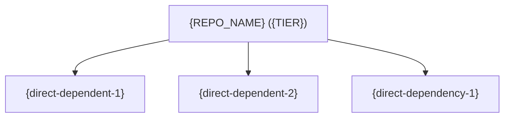

<!--
  TEMPLATE: agents-minimap-section.md
  PURPOSE : "Ecosystem Position" section inserted into every repo's AGENTS.md body.
            Gives agents an immediate spatial orientation — both an ego-centric view
            (unique, close-up) and a collapsed full-platform map (shared, big-picture).

  PLACEMENT: Add this section near the top of the AGENTS.md body, directly after
             the "Cross-Repo Bootstrap" section and before repo-specific skill or
             rule sections.

  PLACEHOLDERS TO REPLACE (UNIQUE per repo — author manually):
  ─────────────────────────────────────────────────────────────
    {UNIQUE EGO-CENTRIC DIAGRAM}
        A Mermaid diagram centred on THIS repo, with ASCII fallback.
        Show: this repo → its direct dependents → its direct dependencies.
        Keep it small (≤ 15 nodes).

        Mermaid example:
            ```mermaid
            graph TD
                THIS["iac-eks-argocd (core)"]
                THIS --> IEAD["iac-eks-addons"]
                THIS --> IEKC["iac-eks-crossplane"]
                THIS --> IEOB["iac-eks-observability"]
            ```

        Then add ASCII fallback in <details> block for terminal readability.

    {UNIQUE RELATIONSHIP TABLE}
        A Markdown table listing each direct relationship with columns:
          Repo | Direction | What This Repo Provides / Consumes
        Direction values: "→ produces for", "← consumes from", "↔ bidirectional"
        Limit to direct (1-hop) relationships; omit transitive ones.

  PLACEHOLDERS TO REPLACE (SHARED across all repos — copy from master-map.md):
  ─────────────────────────────────────────────────────────────────────────────
    {FULL ECOSYSTEM DIAGRAM}
        Copy the master ASCII diagram from
        ../mobius-tools/ecosystem/master-map.md (generated in Step 3).
        This block is identical in every repo.

    {FULL REPO TABLE}
        Copy the complete repo table from master-map.md.
        Columns: Repo | Type | Role | Key Consumers
        This block is identical in every repo.

  RULES:
    - Do NOT fill the shared placeholders until master-map.md exists (Step 3).
    - The <details> block MUST remain collapsed by default (do not add `open`).
    - Preserve the HTML comment markers so automated tooling can find/replace
      the shared blocks in bulk during the Step 5 rollout.
-->

<!-- ======================================================
     COPY FROM HERE ↓  (paste into AGENTS.md body)
     ====================================================== -->

## Ecosystem Position

### This Repo's Relationships

<!-- UNIQUE:START — replace with ego-centric diagram for {REPO_NAME} -->



<details>
<summary>ASCII fallback (terminal/agent view)</summary>

```
{UNIQUE ASCII EGO-CENTRIC DIAGRAM — different per repo}
```

</details>

<!-- UNIQUE:END -->

<!-- UNIQUE:TABLE:START — replace with relationship table for {REPO_NAME} -->

{UNIQUE RELATIONSHIP TABLE — different per repo}

| Repo | Direction | What Is Exchanged |
|------|-----------|-------------------|
| `{dependency-repo}` | ← consumes from | {description of what this repo consumes} |
| `{consumer-repo}` | → produces for | {description of what this repo produces} |

<!-- UNIQUE:TABLE:END -->

<details>
<summary>Full Mobius Ecosystem Map (click to expand)</summary>

<!-- SHARED:DIAGRAM:START — replace with full ecosystem diagram from master-map.md -->

{FULL ECOSYSTEM DIAGRAM — same across all repos, sourced from mobius-tools/ecosystem/master-map.md}

<!-- SHARED:DIAGRAM:END -->

<!-- SHARED:TABLE:START — replace with full repo table from master-map.md -->

{FULL REPO TABLE — same across all repos, sourced from mobius-tools/ecosystem/master-map.md}

| Repo | Type | Role | Key Consumers |
|------|------|------|---------------|
| `{repo-name}` | {type} | {role} | {consumers} |

<!-- SHARED:TABLE:END -->

</details>

<!-- ======================================================
     COPY TO HERE ↑
     ====================================================== -->
